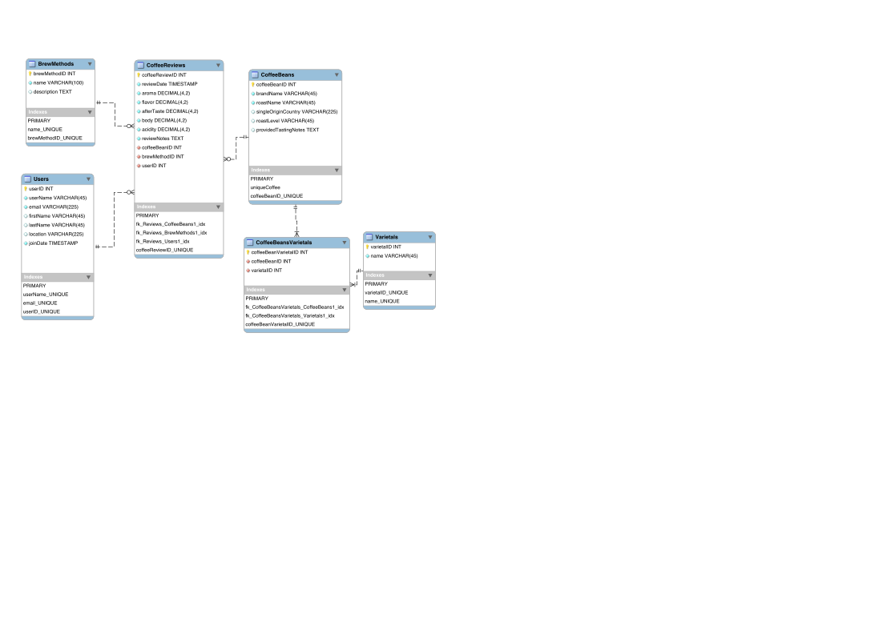

# Roast Review

A database-driven coffee review web app featuring relational schema design, many-to-many relationships, and full CRUD functionality. Built as a CS340 group project at Oregon State University.

Team Members: Katlin Hopkins, Thomas Kiss  
Team Name: Team 2  
Course: CS340  
Date/Term: Spring 2025

## Live Demo

- **App:** [https://cs340roastreview.vercel.app/](https://cs340roastreview.vercel.app/)

## Features

- **Full CRUD** on Users, Brew Methods, Coffee Beans, Varietals, Coffee Bean Varietals, and Coffee Reviews
- **Many-to-many relationships** (e.g. Coffee Beans ↔ Varietals) modeled with junction tables and dynamic, filtered dropdowns
- Dynamic Create/Update forms that pre-populate from the selected record

## Tech Stack

**Frontend:** React (Vite), React Router
**Backend:** Node.js, Express
**Database:** MySQL
**Deployment:** Vercel (frontend), Render (backend), AWS RDS (database)

## ER Diagram

## Citations

Citations for the CS340 starter code and AI tool usage are documented separately in [CITATIONS.md](CITATIONS.md).
